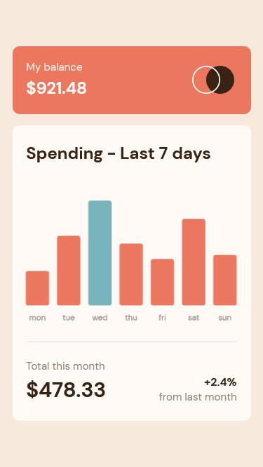
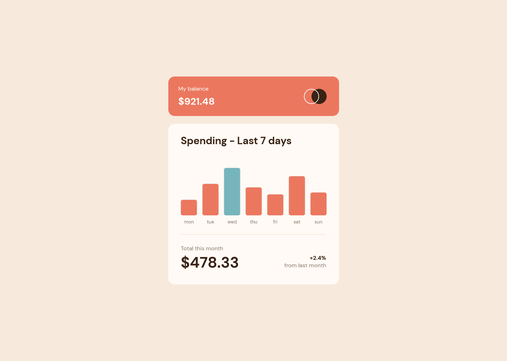

# Frontend Mentor - Expenses chart component solution

This is a solution to the [Expenses chart component challenge on Frontend Mentor](https://www.frontendmentor.io/challenges/expenses-chart-component-e7yJBUdjwt). Frontend Mentor challenges help you improve your coding skills by building realistic projects. 

## Table of contents

- [Overview](#overview)
  - [The challenge](#the-challenge)
  - [Screenshot](#screenshot)
  - [Links](#links)
- [My process](#my-process)
  - [Built with](#built-with)
  - [What I learned](#what-i-learned)
  - [Useful resources](#useful-resources)
- [Author](#author)

## Overview

### The challenge

Users should be able to:

- View the bar chart and hover over the individual bars to see the correct amounts for each day
- See the current day’s bar highlighted in a different colour to the other bars
- View the optimal layout for the content depending on their device’s screen size
- See hover states for all interactive elements on the page
- **Bonus**: Use the JSON data file provided to dynamically size the bars on the chart

### Screenshot




### Links

- Solution URL: [Solution](#)
- Live Site URL: [Live Demo](#)

## My process

### Built with

- Semantic HTML5 markup
- CSS custom properties
- Flexbox
- CSS Grid
- Mobile-first workflow
- CSS Vendor Prefixes
- [Chart.js](https://www.chartjs.org/) - JS library

### What I learned

In this project I learned to used `clamp()` and `calc()` css functions.
The `clamp()` CSS function clamps a value between an upper and lower bound. `clamp()` enables selecting a middle value within a range of values between a defined minimum and maximum. It takes three parameters: a minimum value, a preferred value, and a maximum allowed value.

The `calc()` CSS function lets you perform calculations when specifying CSS property values.

To see how you can add code snippets, see below:

```css
.card {
	width: clamp(300px, 340px, calc(100% - 1.8rem));
}
```

And after, I learned to used `forEach()` javaScript method.
The forEach() method executes a provided function once for each array element.

To see how you can add code snippets, see below:

```js
config.data.datasets.forEach((datasetData) => {
  if (window.innerWidth >= 600) {
    datasetData.barThickness = 45
    datasetData.borderRadius = 6
  } else {
    datasetData.barThickness = 33
    datasetData.borderRadius = 4
  }
})
```

### Useful resources

- [MDN](https://developer.mozilla.org/en-US/docs/Web/CSS/clamp) - This helped me for use `clamp()` css function.
- [MDN](https://developer.mozilla.org/en-US/docs/Web/CSS/calc) - This helped me for use `calc()` css function.
- [MDN](https://developer.mozilla.org/en-US/docs/Web/JavaScript/Reference/Global_Objects/Array/forEach) - This helped me for use `forEach()` javaScript method.
- [Chartjs](https://www.chartjs.org/docs/latest/) - This helped me for how to create chart by chartjs library
- [Traversy Media](https://www.youtube.com/watch?v=PoRJizFvM7s) - This helped me for understand how to get and show on asynchronous data
- [Traversy Media](https://www.youtube.com/watch?v=Oive66jrwBs) - This helped me for how to get data from external file or web api by use fetch API

## Author

- Frontend Mentor - [@James-alderson](https://www.frontendmentor.io/profile/James-alderson)
